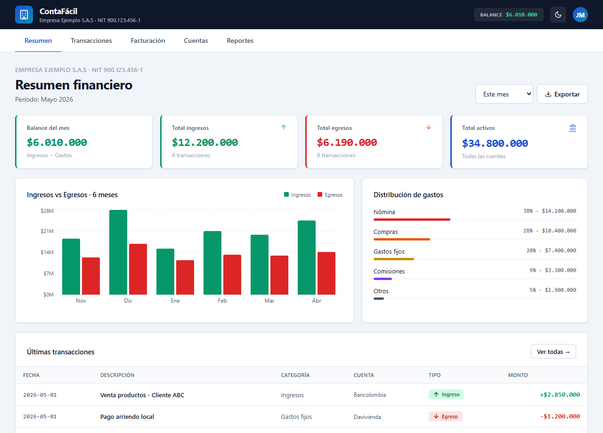
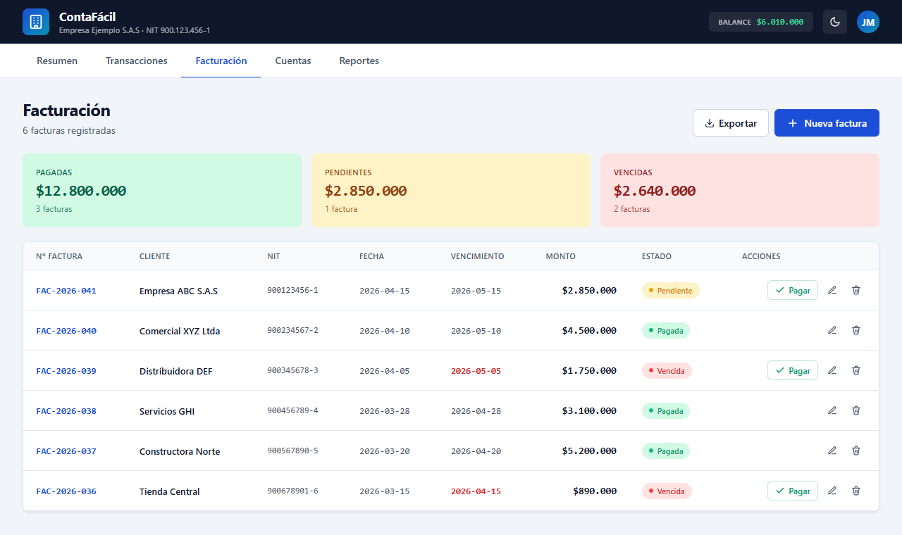

# ContaFácil — SMB Accounting & Invoicing

[](https://github.com/Juanmaya25/contafacil-accounting/actions/workflows/ci.yml)
[](https://github.com/Juanmaya25/contafacil-accounting/actions/workflows/deploy.yml)
[](https://opensource.org/licenses/MIT)

> A focused accounting dashboard for small and medium businesses — cash flow, invoicing, bank accounts and financial reporting in a single screen, with light/dark themes and CSV export.

**Live demo → [juanmaya25.github.io/contafacil-accounting](https://juanmaya25.github.io/contafacil-accounting)**



> Financial summary: KPIs in COP, 6-month income-vs-expense chart, expense breakdown and the latest ledger entries.



> Invoicing: lifecycle status (paid / pending / overdue) with per-status totals and one-click "mark as paid".

---

## The problem

Small businesses in Latin America rarely need full ERP suites — they need to answer three questions fast: *How much did I make this month? Who owes me? Where is my money?* Off-the-shelf tools are either heavyweight (SAP, Siigo) or generic spreadsheets that break the moment a second person touches them.

ContaFácil is a single-page accounting front end that models that core workflow: record income/expenses, issue and track invoices through their lifecycle (paid → pending → overdue), keep an eye on bank and cash balances, and read it all back as KPIs and charts — formatted in Colombian pesos and built to feel like banking software, not a toy.

## Architecture

The app is a client-side React SPA (no backend; seed data ships in-bundle and lives in component state). The codebase is organised by responsibility so a reviewer can find any concern in seconds:

```
src/
├── App.jsx                 # Orchestrator: state, business actions, page routing (~200 lines)
├── main.jsx                # React entry point
├── index.css               # Reset, scrollbars, fade-in, responsive grid breakpoints
├── data/
│   ├── seed.js             # Demo transactions, invoices, accounts, monthly series
│   └── themes.js           # Light/dark palettes + invoice-status color map
├── utils/
│   ├── format.js           # COP currency formatting
│   ├── csv.js              # CSV serialisation + browser download
│   ├── ids.js              # Sequential & invoice-number ID generation
│   └── styles.js           # Theme-derived inline style factory
├── hooks/
│   ├── useToast.js         # Auto-dismissing toast with timer cleanup
│   └── useFilteredTransactions.js  # Memoised search + type filtering
├── components/
│   ├── icons.jsx           # Inline SVG icon set (no icon dependency)
│   ├── Header.jsx, TabBar.jsx
│   ├── Modal.jsx, ConfirmDialog.jsx, Toast.jsx
│   └── TransactionForm.jsx, InvoiceForm.jsx
└── pages/
    ├── Dashboard.jsx       # KPIs, income-vs-expense bar chart, expense breakdown
    ├── Transactions.jsx    # Searchable/filterable ledger with inline CRUD
    ├── Invoices.jsx        # Invoice lifecycle + status totals
    ├── Accounts.jsx        # Bank/cash/receivable cards
    └── Reports.jsx         # Margin, liquidity, trend & category charts
```

## Key decisions

| Decision | Why |
|---|---|
| **Refactored a monolithic `App.jsx` into `data / utils / hooks / components / pages`** | The original was a single ~880-line file. Splitting by concern keeps each unit testable and makes the diff a recruiter reads tell a story about structure, not just features. The visual output is byte-for-byte identical. |
| **Inline styles driven by a theme object** | A `themes[light\|dark]` palette feeds a `makeStyles(C)` factory, so dark mode is a single state toggle with no CSS-class duplication. Trade-off: no CSS cascade, but full type-free theming and zero runtime CSS framework. |
| **Pure utilities (`format`, `csv`, `ids`) extracted from the component tree** | Currency formatting, CSV export and ID generation are the logic most likely to break silently — so they're pure functions covered directly by unit tests. |
| **Seed data as the source of truth** | No backend keeps the demo instant and deployable to GitHub Pages, while the state shape mirrors what a real API would return — the components wouldn't change if a fetch layer were added. |
| **Recharts for visualisation** | Battle-tested, responsive out of the box, and `ResponsiveContainer` is polyfilled in tests via a `ResizeObserver` shim. |

## Tech stack

- **React 18** — hooks, `useMemo`, `useCallback`
- **Vite 5** — dev server + build
- **Recharts** — bar, area and pie charts
- **Vitest + Testing Library + jsdom** — unit and component tests
- **GitHub Actions + GitHub Pages** — CI (test + build) and CD

## Tests

```bash
npm test
```

16 tests across four suites:

- `utils/format.test.js` — COP formatting, null/NaN handling
- `utils/ids.test.js` — sequential and invoice-number generation
- `utils/csv.test.js` — header building, quote escaping, row serialisation
- `App.test.jsx` — render smoke test, tab navigation, invoice rendering, dark-mode toggle

CI runs the full suite and a production build on every push and pull request.

## Run locally

```bash
git clone https://github.com/Juanmaya25/contafacil-accounting.git
cd contafacil-accounting
npm install
npm run dev      # http://localhost:5173/contafacil-accounting/
npm test         # run the test suite
npm run build    # production build to dist/
```

## Author

**Juan José Maya** — Full Stack Developer · San Pedro, Antioquia, Colombia

- Portfolio: [juanmaya25.github.io](https://juanmaya25.github.io)
- GitHub: [@Juanmaya25](https://github.com/Juanmaya25)
- Email: [juanjosemaya2510@gmail.com](mailto:juanjosemaya2510@gmail.com)

## License

MIT © Juan José Maya
